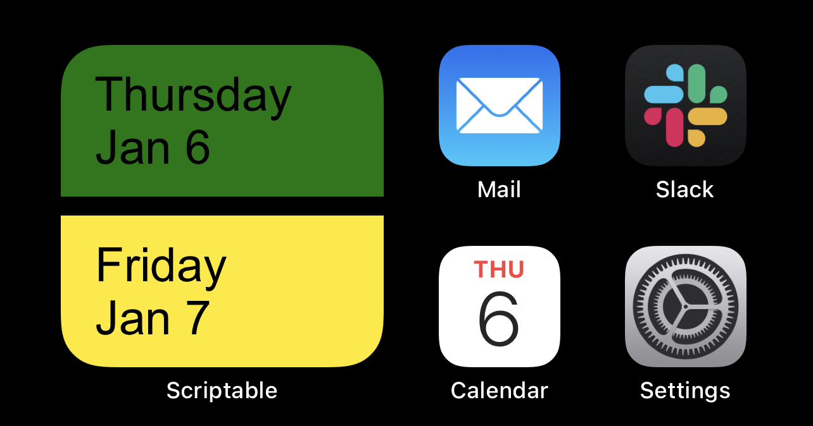

# onCallWidget

- Written to run as an iOS widget via the [Scriptable](https://scriptable.app) application.
- Adapted heavily from [@yaylinda](https://github.com/yaylinda/scriptable/blob/main/CalendarEventsWidget.js).

